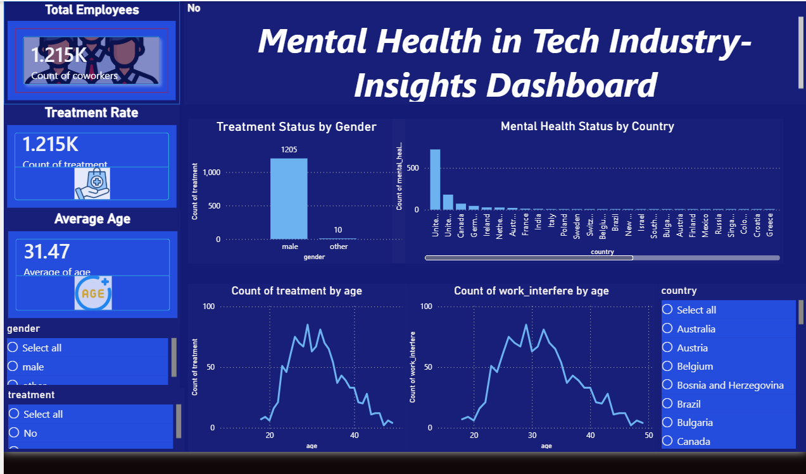

# 🧠 Mental Health Dashboard (Power BI)

## 📌 Project Overview
This project analyzes mental health trends in the tech industry using the OSMI dataset. The dashboard provides insights into treatment patterns, demographics, and workplace impact.

## 📊 Dashboard Preview

## 🎥 Demo Video
[Click here to watch the demo](demo dashbord video.mp4)

## 🔍 Key Insights
- Treatment varies across gender
- Age influences mental health trends
- Country-wise differences observed

## 🛠️ Tools Used
- Power BI
- Excel / CSV Dataset

## 🚀 How to Use
1. Download the `.pbix` file
2. Open in Power BI Desktop
3. Interact using slicers

## 📁 Files Included
- mental-health-dashboard.pbix
- cleaned_osmi.csv
- dashboard.png
